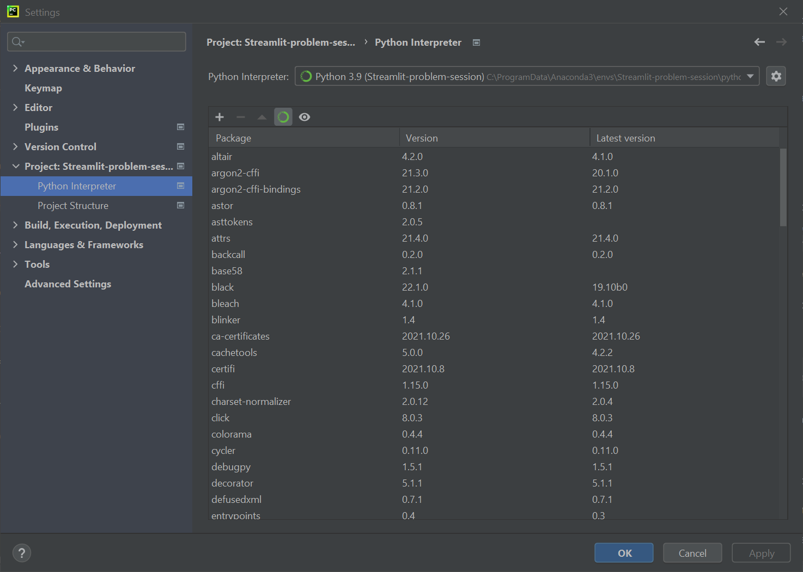
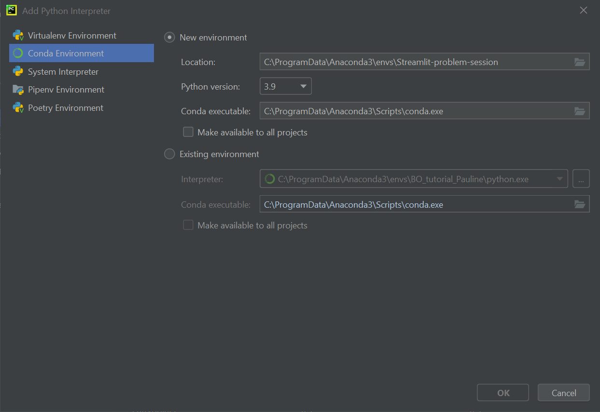

# Streamlit-problem-session
*- D. Pintossi, February 2022 -*

Repository for the Chemical Engineering problem session of Thursday February 17, 2022. We will use Python and Streamlit to create an interactive web app based on the content of Fabian's problem session (stoichiometry in gas-liquid reactions).

The resulting web app is hosted [here](https://share.streamlit.io/noel-research-group/streamlit-problem-session/main/main.py).

___

### Getting ready
#### 1. Install PyCharm CE

To edit and run Python code, we will use an integrated development environment (IDE).
To install PyCharm Community Edition, head to its [website](https://www.jetbrains.com/pycharm/download/#section=windows) and download the installer.

#### 2. Install Anaconda Individual Edition

To manage Python packages (pre-built, open-source code) and virtual environements, we use Conda.
To use Conda, install Anaconda Individual Edition from [here](https://www.anaconda.com/products/individual).

#### 3. Clone the repository
(**Note:** the repository is a work in progress, so wait till Thursday)

PyCharm should guide you to create a project when first opened. If that is not the case, choose `File` from the menu, then `New Project...`.
Keep the default location, unless you have a valid reason to change it, and choose the project name (the folder will have the same name).
Note that you do **not** want a `main.py` file to be automatically created, as the folder should be empty to clone the repository from GitHub.

In the PyCharm GUI, check the menu at the top. Click on `Git` and from the dropdown menu choose `Clone...`.

Alternatively, if `Git` is not displayed, you will find `VCS` and from the dropdown menu you have to choose `Get from VCS...`.

Use the following URL:
```
https://github.com/Noel-Research-Group/Streamlit-problem-session.git
```
and set the directory to be the one of the project you created.

When you are done, you should see new files appearing. No new files showing up? Pat pat, there there.

#### 4. Adjust interpreter settings
At the top, choose `File` --> `Settings`. In the window that opens, select `Project: blah blah` and then `Python Interpreter` from the list on the left (you should see something like the image below).



Click on the gear icon, select `Conda Environment`, leave everything as it is, except the Python version, which we set to be `3.9` (see image below).



`OK` your way back to the underlying IDE. It may take a moment for the environment to fully set up (loading bar at the bottom).

#### 5. Install the requirements

At the bottom, choose the Terminal tab. Write the following code and hit enter.
```
pip install -r requirements.txt
```
To verify that it worked, run the following command.
```
conda list
```
If `numpy`, `pandas`, `matplotlib`, `scipy`, and `streamlit` are showing up in the list of packages, you are good to go.
